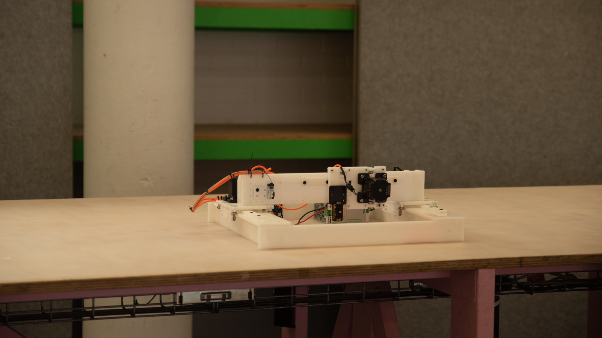
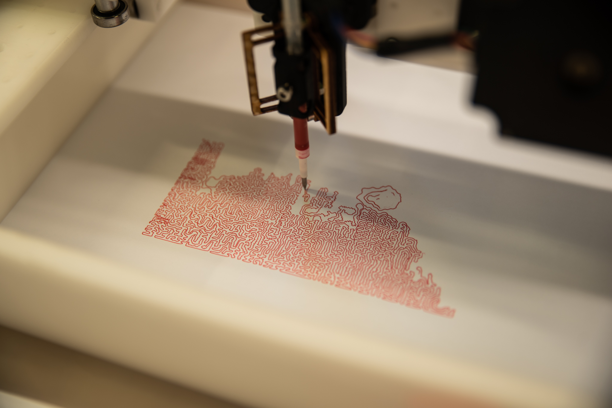
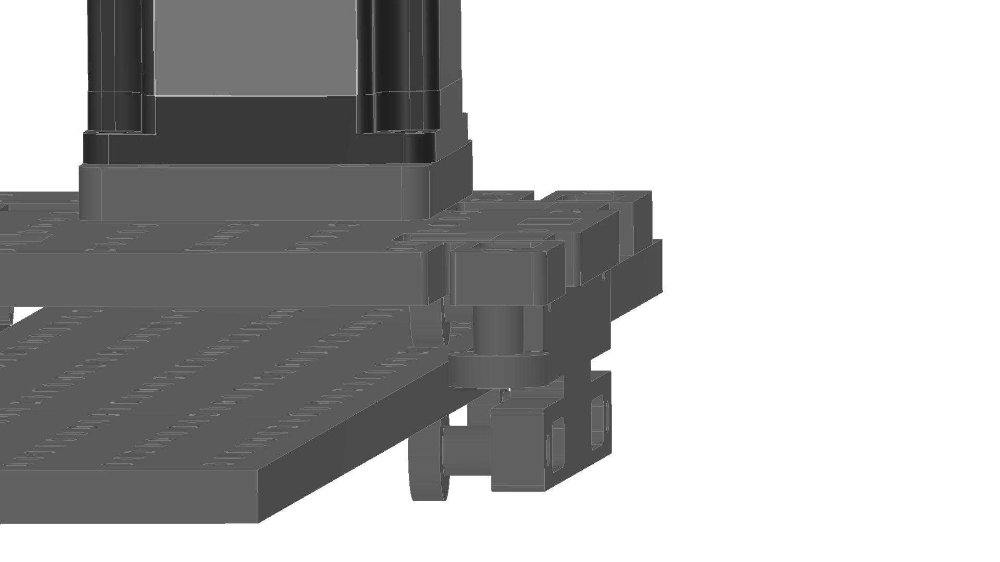
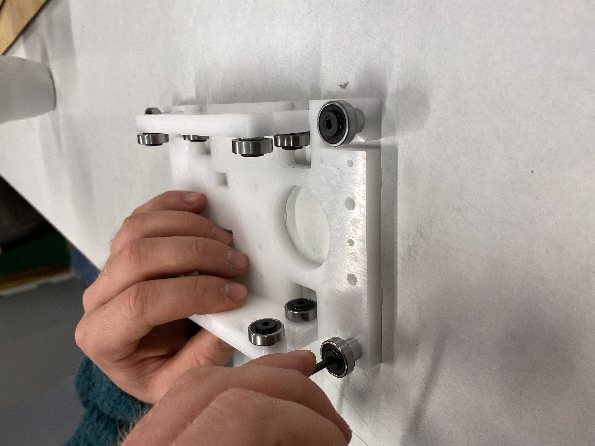
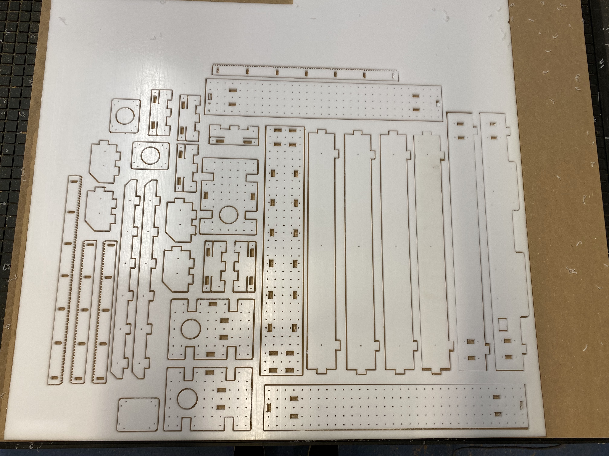

# Hurtig, Fabricatable Machines 2-Axis

2-axis, general motion platform. Made using the [Fabricatable Axis](https://github.com/fellesverkstedet/fabricatable-machines/wiki/Fabricatable-axis), milled in POM. 

Designed in Fusion360.

Good practice: If this is your first round of using Fab Machines, read up on the general wiki for best practices, tips & tricks and theory. 

# Fab Axis Flexure Version

Inspired by [Jake Read](https://gitlab.cba.mit.edu/jakeread/rctgantries), this machine uses a variant of the Fabricatable Axis that uses flexures instead of eccentric screws for bearing tension. The bearings on the flexure side have a 0.2 offset. This turned out great, and gives a tight and easy-to-tune setup. The rack is kept as a separate component, instead of being milled directly into the rail. The rack is milled with slots for tuning (note: Im not sure if this is necessary, and tuning the rack is kind of a hassle. I want to come back to this on next iteration).  

# Milling 

As always, good to surface the waste board to get straight good cuts. Hurtig v1 was milled on a luxurious Multicam 3000 @ Marineholmen Makerspace, in Bergen. This machines offers some luxurious options (vacuum table and tool changing), but all the parts in this case was milled out using a 3mm upcut from VHF (link). 

# Assembly 

Fab Axes and frame are assembled separately. The joints really helps on keeping things aligned. Make sure to remove any tabs from milling. See videos for quick previews.

# Traveling 

Disassemble gantry and frame and pack into carry-on-sandwich

# BOM: Sourcing parts scandinavian style

| Material       | Where to buy                                                     | Price (nok) |
|----------------|------------------------------------------------------------------|-------------|
| HDPE 8mm       | https://www.eplast.no                                            | 1220,-/1m2  |
| NEMA24 Stepper | https://www.creative3d.no                                        | 300,- -ish  |
| Screws         | https://www.clasohlson.com/no/Treskrue-med-panhode/p/40-9568-6   | 26,- /25    |
| Controller     | take your pick. I used a Marlin board from https://ooznest.co.uk |             |

